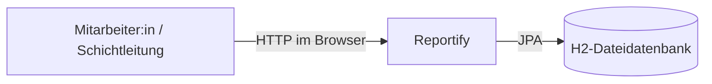
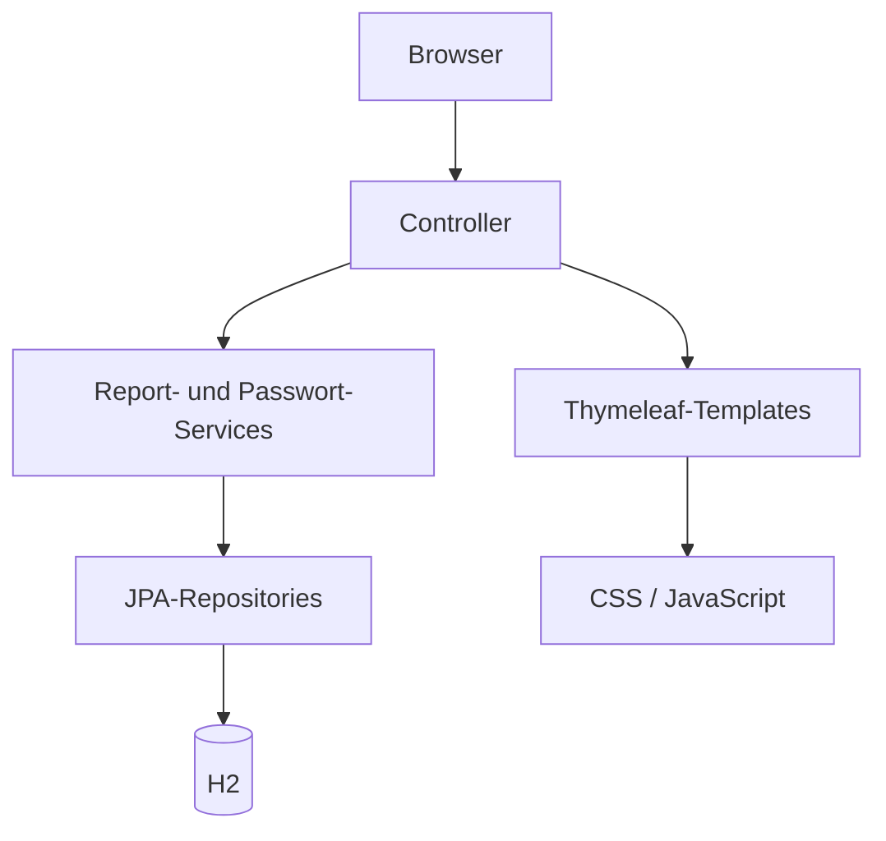

# Architektur von Reportify

> **Stand:** Mit Quellcode und Tests abgeglichen am 25.09.2026.

## 1. Einführung und Ziele

Reportify ist eine serverseitig gerenderte Webanwendung für digitale
Schichtübergaben. Die Architektur unterstützt eine übersichtliche Umsetzung,
einfache lokale Inbetriebnahme, persistente Speicherung und eine angemessene
Absicherung der fachlichen Funktionen.

Die Anwendung ist als modular strukturierter Spring-Boot-Monolith umgesetzt.
Verantwortlichkeiten sind nach Konfiguration, Websteuerung, Reportverwaltung und
Benutzerverwaltung getrennt, ohne die zusätzliche Komplexität verteilter Dienste.

## 2. Randbedingungen

| Bereich | Festlegung |
|---|---|
| Programmiersprache | Java 21 |
| Framework | Spring Boot 4.0.8 |
| Web | Spring MVC und Thymeleaf |
| Sicherheit | Spring Security |
| Persistenz | Spring Data JPA |
| Datenbank | dateibasierte H2-Datenbank |
| Build und Tests | Maven Wrapper und JUnit |
| Oberfläche | HTML, zentrales CSS und ergänzendes JavaScript |
| Versionsverwaltung | Git und GitHub |

## 3. Kontext und Systemgrenze

Angemeldete Mitarbeiter:innen und Schichtleitungen bedienen Reportify im
Browser. Die Anwendung verarbeitet Login- und Reportdaten und speichert sie in
einer lokalen H2-Datenbank. Externe APIs, Benachrichtigungsdienste und
Fremdsysteme gehören nicht zur Version 1.



## 4. Lösungsstrategie

- Spring MVC verarbeitet HTTP-Anfragen über Controller.
- Thymeleaf rendert HTML auf dem Server.
- Serviceklassen kapseln fachliche Validierung und Zustandsänderungen.
- Spring Data JPA übernimmt den Datenzugriff.
- Spring Security schützt alle fachlichen Seiten, prüft Rollen und CSRF-Token.
- Ein Interceptor erzwingt vor der fachlichen Nutzung den ersten
  Passwortwechsel.
- Zentrales CSS sorgt für ein konsistentes responsives Design.
- JavaScript verbessert die Bedienung durch mobiles Menü, Passwortanzeige,
  Zeichenzähler, clientseitige Historienfilter und Löschdialog. Die fachliche
  Autorisierung bleibt unabhängig davon serverseitig erzwungen.

## 5. Bausteinsicht



### 5.1 Pakete und Verantwortlichkeiten

| Paket/Bereich | Verantwortung |
|---|---|
| `de.thm.reportify.config` | Security-Konfiguration, Entwicklungsdaten und Passwortwechsel-Interceptor |
| `de.thm.reportify.controller` | Login-, Passwort-, Startseiten- und Report-Endpunkte |
| `de.thm.reportify.report` | Report-Entity, fachliche Reportlogik und Repository |
| `de.thm.reportify.user` | Nutzer-Entity, Rollen, Passwortregeln und UserDetailsService |
| `templates` | Serverseitig gerenderte Seiten und Formulare |
| `static/css` | gemeinsames Erscheinungsbild einschließlich responsiver Regeln |
| `static/js` | progressive Bedienfunktionen ohne fachliche Berechtigungslogik |

### 5.2 Tatsächliche Projektstruktur

```text
de.thm.reportify
├── ReportifyApplication
├── config
│   ├── EntwicklungsdatenKonfiguration
│   ├── PasswortwechselInterceptor
│   ├── SecurityConfig
│   └── WebConfig
├── controller
│   ├── LoginController
│   ├── PasswortController
│   ├── ReportController
│   └── StartseiteController
├── report
│   ├── Report
│   ├── ReportRepository
│   └── ReportService
└── user
    ├── Nutzer
    ├── NutzerRepository
    ├── PasswortRegeln
    ├── PasswortService
    ├── ReportifyUserDetailsService
    └── Rolle
```

## 6. Laufzeitsichten

### 6.1 Report erstellen

1. Eine angemeldete Person öffnet `GET /reports/new`.
2. `ReportController` rendert das Erfassungsformular.
3. Das Formular sendet `POST /reports` mit CSRF-Token.
4. `ReportService` bereinigt und validiert die Eingaben.
5. `ReportRepository` speichert die Entity.
6. Der Controller leitet zur Detailseite des neuen Reports weiter.

### 6.2 Erster Passwortwechsel

1. Spring Security authentifiziert Benutzername und Startpasswort.
2. Der Interceptor erkennt `passwortwechselErforderlich`.
3. Die Person wird zu `/passwort-aendern` geleitet.
4. `PasswortService` prüft Länge und Bestätigung, hasht das Passwort und beendet
   den erzwungenen Passwortwechsel.
5. Danach sind die geschützten Reportseiten erreichbar.

### 6.3 Report löschen

1. Nur für die Schichtleitung zeigt die Detailseite die Löschaktion.
2. Vor dem Absenden fragt ein nativer Dialog nach Bestätigung.
3. `POST /reports/{id}/delete` wird mit CSRF-Token gesendet.
4. Spring Security prüft serverseitig `ROLE_SCHICHTLEITUNG`.
5. Der Service löscht den Report oder liefert eine verständliche Fehlermeldung.

### 6.4 Report als erledigt markieren

1. Eine angemeldete Person sendet `POST /reports/{id}/complete`.
2. Der Service lädt den Report und setzt den Status auf `ERLEDIGT`.
3. Die Detailseite zeigt den aktualisierten Status; der Report bleibt gespeichert.

## 7. Verteilungssicht

Version 1 läuft als einzelner Java-Prozess. Thymeleaf-Templates und statische
Assets werden aus demselben Artefakt ausgeliefert. Die H2-Datenbank wird lokal im
Verzeichnis `reportify/data` gespeichert. Für die Entwicklungszugänge muss das
Profil `dev` aktiviert sein.

## 8. Querschnittskonzepte

### 8.1 Sicherheit

- formularbasierte Anmeldung und serverseitige Sitzung,
- PBKDF2-Passworthashes statt Klartextpasswörtern,
- erzwungener persönlicher Passwortwechsel bei der ersten Anmeldung,
- serverseitige Rollenprüfung für das Löschen,
- CSRF-Schutz für schreibende Anfragen,
- öffentliche Freigabe nur für Login und statische CSS-/JavaScript-Ressourcen,
- Fehlerseiten ohne Stacktrace oder interne Details.

### 8.2 Validierung

Reporttexte werden serverseitig bereinigt und auf maximal 4.000 Zeichen geprüft.
„Erledigte Aufgaben“ und Schicht sind verpflichtend. Bei Problemen oder Incidents
ist eine Priorität erforderlich. HTML-Attribute und Zeichenzähler geben bereits
im Browser Rückmeldung, ersetzen aber nicht die serverseitige Prüfung.

### 8.3 Persistenz und Zeit

`Report` und `Nutzer` sind JPA-Entities. Report-IDs und Nutzer-IDs werden von der
Datenbank erzeugt. Zeitpunkte werden als `LocalDateTime` ohne separate
Zeitzoneninformation gespeichert. `createdBy` und `updatedBy` enthalten den
Benutzernamen als Text; zwischen Report und Nutzer besteht in Version 1 kein
Fremdschlüssel.

### 8.4 Oberflächenlogik

Suche und Schichtfilter arbeiten clientseitig ausschließlich auf den bereits
geladenen Historienkarten. Die aktuelle Übergabe bleibt sichtbar. Ohne
JavaScript bleiben die serverseitigen Kernfunktionen zugänglich; Komfortfunktionen
wie Live-Zähler, mobiler Navigationsschalter und Dialog sind dann eingeschränkt.

## 9. Architekturentscheidungen

Die Entscheidungen sind als ADRs dokumentiert:

- [ADR-001: Modularer Monolith](adr/ADR-001-modularer-monolith.md)
- [ADR-002: Thymeleaf statt SPA](adr/ADR-002-thymeleaf-statt-spa.md)
- [ADR-003: H2-Datenbank](adr/ADR-003-h2-datenbank.md)
- [ADR-004: Spring Security](adr/ADR-004-spring-security.md)
- [ADR-005: Report als zentrale Entität](adr/ADR-005-report-zentrale-entitaet.md)

## 10. Qualitätsanforderungen

| Ziel | Architekturbeitrag | Nachweis |
|---|---|---|
| Verständlichkeit | klare Pakete, serverseitige Navigation, einheitliches Design | manuelle Abnahme |
| Sicherheit | Spring Security, Rollenprüfung, CSRF, PBKDF2 | Integrations- und Servicetests |
| Datenintegrität | Servicevalidierung, Transaktionen, JPA-Constraints | Service- und Controllertests |
| Wartbarkeit | modularer Monolith, zentrale CSS-/JS-Dateien | Code- und Dokumentationsabgleich |
| Portabilität | Maven Wrapper, Java 21, lokales Profil | Installationsanleitung |

## 11. Risiken und technische Schulden

- H2 ist für lokale Entwicklung und Demonstration geeignet, nicht als
  Produktionsdatenbank für mehrere Instanzen.
- Die Historienfilterung lädt alle Reports und filtert im Browser. Bei stark
  wachsender Datenmenge wären serverseitige Suche und Seitennavigation nötig.
- Konkrete Leistungsgrenzen wurden noch nicht durch Lasttests nachgewiesen.
- Die Oberfläche wurde in Safari manuell geprüft; eine zusätzliche Prüfung in
  Chrome, bei 360 Pixel Breite und per Tastatur ist noch offen.
- Komfortfunktionen im JavaScript besitzen noch keine automatisierten
  Browsertests.
- `createdBy` und `updatedBy` sind bewusst nicht relational verknüpft; eine
  spätere Umbenennung von Benutzerkonten würde bestehende Texte nicht ändern.

## 12. Tests und Nachweise

Der Stand umfasst 46 erfolgreiche automatisierte Tests. Sie prüfen unter anderem
Security, Passwortwechsel, Reportvalidierung, CRUD-Abläufe, Statuswechsel,
Rollenberechtigungen, CSRF und Fehlerseiten. Die manuell geprüften UI-Abläufe und
offenen Zusatzprüfungen stehen im [Test- und Abnahmenachweis](../ABNAHME.md).

## 13. Einsatz von KI-Werkzeugen

KI-Werkzeuge wurden unterstützend für Entwürfe, Abgleiche und Formulierungen
verwendet. Aussagen wurden anhand von Quellcode, Tests und laufender Anwendung
überprüft. Fachliche Entscheidungen und die formale Freigabe bleiben Aufgabe des
Projektteams.

## 14. Glossar

| Begriff | Bedeutung |
|---|---|
| ADR | Architecture Decision Record |
| Controller | Verarbeitung von HTTP-Anfragen und Auswahl der Antwortansicht |
| H2 | relationale Java-Datenbank für die lokale Version 1 |
| JPA | Abbildung von Java-Entities auf relationale Daten |
| Repository | Datenzugriff auf persistente Entities |
| Service | Kapselung fachlicher Validierung und Zustandsänderungen |
