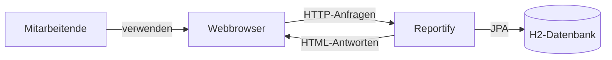
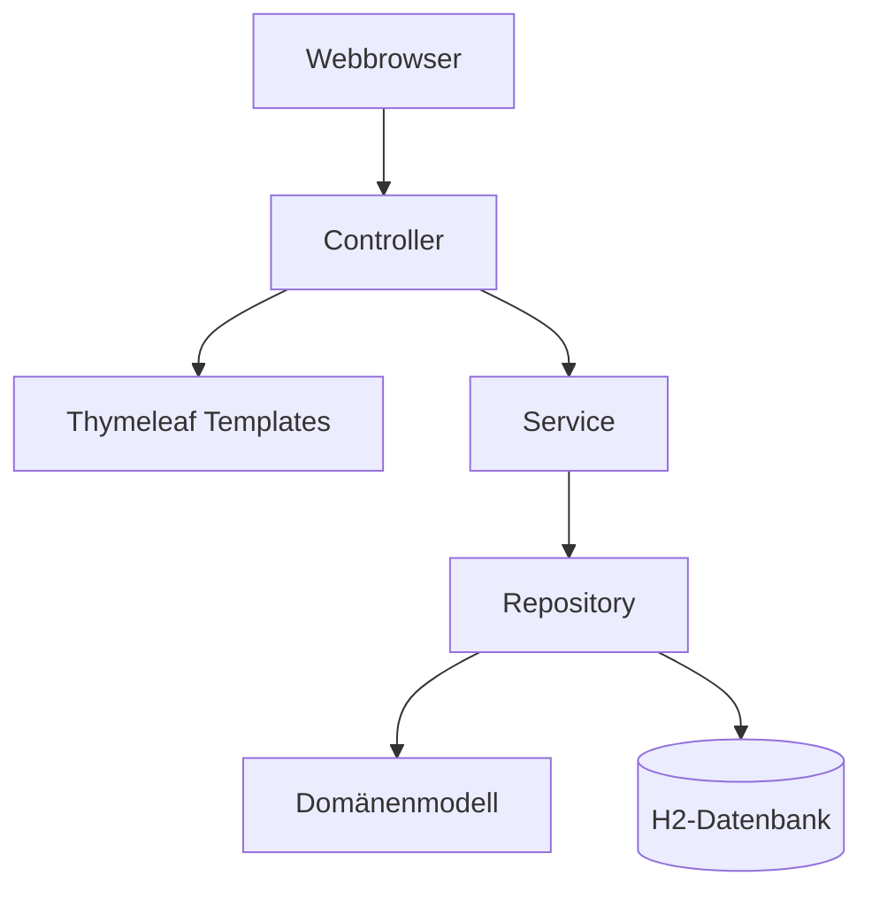
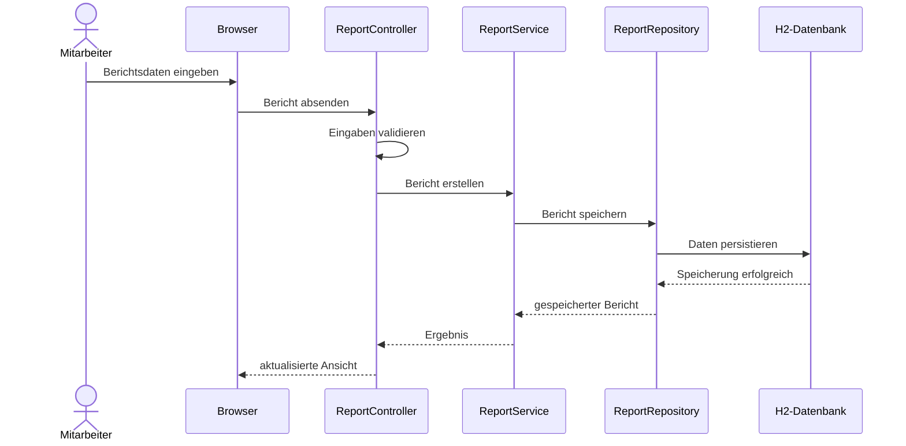
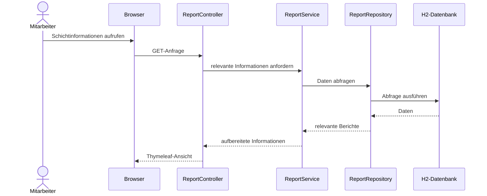
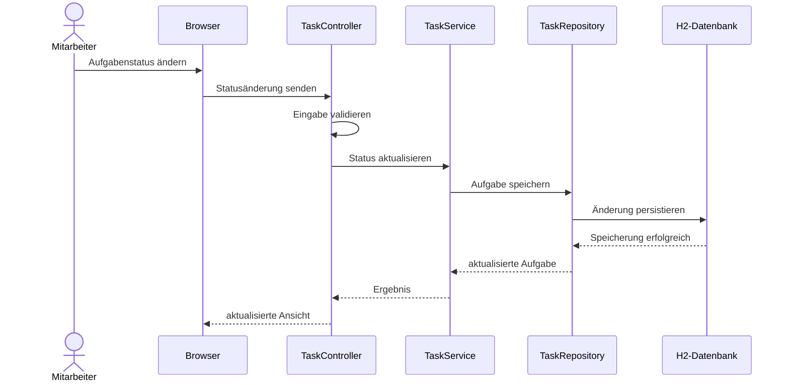
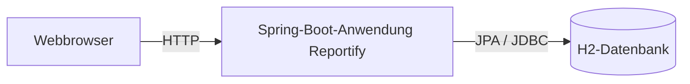

# Architektur von Reportify

## 1. Einführung und Ziele

Dieses Dokument beschreibt die Softwarearchitektur der Anwendung Reportify. Es orientiert sich an der Struktur des arc42-Templates und dient dazu, die wesentlichen Architekturentscheidungen, Systembausteine und technischen Zusammenhänge nachvollziehbar zu dokumentieren.

Reportify ist als webbasierte Anwendung vorgesehen, mit der Mitarbeitende Informationen aus ihrem Arbeitsalltag digital erfassen und für nachfolgende Schichten bereitstellen können. Die Anwendung soll insbesondere die Dokumentation von Berichten, die Verwaltung von Aufgaben und die Informationsweitergabe bei Schichtwechseln unterstützen.

Ziel der Architektur ist eine übersichtliche und für den Projektumfang angemessene Struktur. Die Anwendung wird deshalb als modular strukturierter Spring-Boot-Monolith entwickelt. Die einzelnen Verantwortlichkeiten sollen innerhalb der Anwendung klar voneinander getrennt werden, ohne die zusätzliche technische Komplexität einer verteilten Architektur einzuführen.

Die Architektur soll insbesondere folgende Ziele unterstützen:

- klare Trennung der Verantwortlichkeiten innerhalb der Anwendung,
- einfache Wartbarkeit und Erweiterbarkeit,
- nachvollziehbare Zuordnung zwischen Anforderungen, Architektur und Quellcode,
- serverseitige Bereitstellung der Benutzeroberfläche,
- persistente Speicherung der Anwendungsdaten,
- angemessene Absicherung und Validierung der Anwendung.

## 2. Randbedingungen

Für die Entwicklung von Reportify bestehen folgende technische und organisatorische Randbedingungen:

| Bereich | Festlegung |
|---|---|
| Programmiersprache | Java 21 |
| Framework | Spring Boot 4.0.8 |
| Web-Technologie | Spring MVC |
| Benutzeroberfläche | Thymeleaf |
| Persistenz | Spring Data JPA |
| Datenbank | H2 |
| Build-System | Maven |
| Versionsverwaltung | Git und GitHub |

Die genannten Technologien entsprechen dem aktuellen Stand des Projekts. Spring Security ist derzeit noch nicht in den Abhängigkeiten des Projekts enthalten und wird daher als geplante Erweiterung und nicht als bereits implementierter Bestandteil betrachtet.

## 3. Kontextabgrenzung

Reportify wird über einen Webbrowser verwendet. Der Browser stellt die Benutzerschnittstelle dar und kommuniziert über HTTP mit der Spring-Boot-Anwendung. Die Anwendung verarbeitet die Anfragen, führt die Anwendungslogik aus und greift für persistente Daten über Spring Data JPA auf die Datenbank zu.



Externe Nachbarsysteme sind im aktuellen Projektstand nicht vorgesehen. Reportify bildet damit zunächst ein in sich geschlossenes Anwendungssystem.

## 4. Lösungsstrategie

Für Reportify wird ein modular strukturierter Monolith auf Basis von Spring Boot verwendet. Alle Bestandteile der Anwendung werden gemeinsam entwickelt, gebaut und ausgeführt. Innerhalb des Monolithen werden die Verantwortlichkeiten jedoch durch klar getrennte Schichten beziehungsweise Pakete strukturiert.

Die grundlegende Verarbeitung einer Anfrage soll nach folgendem Prinzip erfolgen:

```text
Webbrowser
    |
    v
Controller
    |
    v
Service
    |
    v
Repository
    |
    v
Datenmodell / Datenbank
```

Die Darstellung der Benutzeroberfläche erfolgt serverseitig mit Thymeleaf. Controller nehmen HTTP-Anfragen entgegen und koordinieren die Verarbeitung. Die eigentliche Geschäftslogik wird in Services gekapselt. Repository-Komponenten übernehmen mithilfe von Spring Data JPA den Datenzugriff.

Diese Struktur wurde gewählt, da sie für den Umfang des Projekts eine klare Trennung der Verantwortlichkeiten ermöglicht, ohne die Komplexität einer Microservice- oder separaten SPA-Architektur einzuführen.

## 5. Bausteinsicht

### 5.1 Übersicht

Die geplante interne Struktur von Reportify besteht aus folgenden Bausteinen:



### 5.2 Controller

Die Controller bilden die Schnittstelle zwischen Webbrowser und Anwendungslogik. Sie nehmen HTTP-Anfragen entgegen, verarbeiten Eingaben und wählen die darzustellenden Thymeleaf-Templates aus.

Im aktuellen Stand existiert bereits der `StartseiteController`. Dieser verarbeitet einen GET-Aufruf auf `/` und liefert das Template `startseite` zurück.

### 5.3 Service

Die Service-Schicht soll die fachliche Anwendungslogik enthalten. Dadurch wird verhindert, dass Geschäftslogik direkt in Controllern oder Repository-Klassen implementiert wird.

Für die zentralen fachlichen Funktionen sind beispielsweise Services für Berichte und Aufgaben vorgesehen.

### 5.4 Repository

Die Repository-Schicht kapselt den Zugriff auf persistente Daten. Hierfür wird Spring Data JPA verwendet. Controller sollen nicht unmittelbar auf die Datenbank zugreifen, sondern über Service- und Repository-Komponenten.

### 5.5 Domänenmodell

Das Domänenmodell enthält die fachlichen Entitäten der Anwendung. Nach aktuellem Planungsstand gehören insbesondere Berichte, Aufgaben und Benutzer zu den relevanten fachlichen Konzepten. Die endgültige Ausgestaltung der Entitäten muss mit dem Datenmodell der Spezifikation und dem tatsächlich implementierten Code synchron gehalten werden.

### 5.6 Benutzeroberfläche

Die Benutzeroberfläche wird serverseitig mit Thymeleaf erzeugt. Die Templates befinden sich unter `src/main/resources/templates`. Dadurch ist für die erste Version kein separates JavaScript-Frontend notwendig.

## 6. Laufzeitsicht

Die folgenden Laufzeitsichten zeigen die vorgesehene Verarbeitung zentraler Anwendungsfälle. Da die fachliche Implementierung noch nicht vollständig vorliegt, beschreiben sie die Zielarchitektur und müssen bei der weiteren Implementierung mit den endgültigen Anwendungsfällen abgeglichen werden.

### 6.1 Bericht erstellen



### 6.2 Informationen für die Schichtübergabe anzeigen



### 6.3 Aufgabenstatus aktualisieren



## 7. Deployment-Sicht

Reportify ist für die erste Version als einzelne Spring-Boot-Anwendung vorgesehen. Der Benutzer benötigt lediglich einen Webbrowser. Die Anwendung enthält die Web-, Geschäftslogik- und Persistenzkomponenten.



Die Spring-Boot-Anwendung wird als eine deploybare Einheit ausgeführt. Dadurch bleibt das Deployment für den Projektumfang einfach. Eine Aufteilung auf mehrere unabhängig deploybare Dienste ist für Version 1 nicht vorgesehen.

Die H2-Abhängigkeit ist bereits im Projekt vorhanden. Eine konkrete Konfiguration als dateibasierte Datenbank ist im aktuellen Stand von `application.properties` jedoch noch nicht vorhanden und muss bei einer entsprechenden Umsetzung ergänzt werden.

## 8. Querschnittskonzepte

### 8.1 Security

Die Anwendung soll geschützte Funktionen nur authentifizierten beziehungsweise entsprechend berechtigten Benutzern zur Verfügung stellen. Als technische Lösung ist Spring Security vorgesehen.

Spring Security ist im aktuellen Projektstand noch nicht als Dependency eingebunden. Das Sicherheitskonzept stellt daher derzeit eine Architekturentscheidung für die weitere Implementierung dar und darf erst nach entsprechender Umsetzung als implementiert betrachtet werden.

### 8.2 Persistenz

Für die Persistenz wird Spring Data JPA verwendet. Der Datenzugriff erfolgt über Repository-Komponenten. Als Datenbank ist für die erste Version H2 vorgesehen.

Dadurch bleibt die Persistenzlogik von der Web- und Geschäftslogik getrennt. Eine spätere Umstellung auf ein anderes relationales Datenbanksystem wird dadurch erleichtert.

### 8.3 Validierung

Benutzereingaben müssen vor ihrer Verarbeitung geprüft werden. Fachlich ungültige oder unvollständige Daten dürfen nicht ungeprüft persistiert werden.

Die Validierung soll möglichst an den Eingabeobjekten beziehungsweise an den Grenzen der Anwendung erfolgen. Zusätzliche fachliche Prüfungen werden in der Service-Schicht durchgeführt.

### 8.4 Fehlerbehandlung

Technische und fachliche Fehler sollen kontrolliert behandelt werden. Benutzer sollen verständliche Fehlermeldungen erhalten, ohne interne technische Details der Anwendung offenzulegen.

Wiederkehrende Fehlerbehandlung soll möglichst zentral umgesetzt werden, beispielsweise durch Spring-MVC-Mechanismen zur zentralen Behandlung von Exceptions.

## 9. Paketstruktur

Für die weitere Entwicklung wird folgende Zielstruktur innerhalb des Basispakets `de.thm.reportify` vorgesehen:

```text
de.thm.reportify
├── controller
│   ├── StartseiteController
│   ├── ReportController
│   └── TaskController
├── service
│   ├── ReportService
│   └── TaskService
├── repository
│   ├── ReportRepository
│   └── TaskRepository
├── model
│   ├── Report
│   ├── Task
│   └── User
├── config
│   └── SecurityConfig
└── ReportifyApplication
```

Diese Struktur stellt die Zielarchitektur dar. Im aktuellen Implementierungsstand befinden sich `ReportifyApplication` und `StartseiteController` noch direkt im Package `de.thm.reportify`. Die Paketstruktur muss deshalb im weiteren Projektverlauf schrittweise mit der Architektur synchronisiert werden.

## 10. Architektur und Implementierung

Die Architekturdokumentation wird gemeinsam mit dem Quellcode weiterentwickelt. Architekturentscheidungen dürfen nicht lediglich dokumentiert werden, sondern müssen sich im tatsächlichen Code widerspiegeln.

Für die weitere Entwicklung gelten insbesondere folgende Zuordnungen:

| Architekturkonzept | Umsetzung im Code |
|---|---|
| Web-Schicht | Controller |
| Geschäftslogik | Service-Klassen |
| Persistenzzugriff | Repository-Klassen |
| Fachliche Daten | Model-/Entity-Klassen |
| Benutzeroberfläche | Thymeleaf-Templates |
| Konfiguration | Spring-Konfiguration und `application.properties` |

Bei Änderungen am Code muss geprüft werden, ob die Architekturdokumentation ebenfalls angepasst werden muss. Umgekehrt dürfen geplante Architekturbausteine nicht als bereits implementiert dargestellt werden, solange sie im Quellcode noch nicht vorhanden sind.

## 11. Architekturentscheidungen

Wesentliche Architekturentscheidungen werden als Architecture Decision Records (ADRs) im Unterordner `docs/arch/adr` dokumentiert.

Folgende Entscheidungen sind für Reportify relevant:

1. modular strukturierter Spring-Boot-Monolith,
2. Thymeleaf anstelle einer separaten Single-Page-Application,
3. H2 als Datenbank für Version 1,
4. Spring Security für Authentifizierung und Autorisierung,
5. Report als zentrale fachliche Entität.

Der Status der einzelnen Entscheidungen wird in den jeweiligen ADRs dokumentiert. Entscheidungen, deren technische oder fachliche Umsetzung noch nicht abschließend feststeht, werden zunächst als `Proposed` gekennzeichnet.

## 12. Risiken und technische Schulden

Der aktuelle Entwicklungsstand weist insbesondere folgende Risiken beziehungsweise offene Punkte auf:

- Die fachliche Spezifikation ist in mehreren Bereichen noch nicht vollständig ausgearbeitet.
- Das endgültige Datenmodell muss mit der Architektur und den JPA-Entitäten abgestimmt werden.
- Die geplante Paketstruktur ist im Code noch nicht vollständig umgesetzt.
- Spring Security ist noch nicht integriert.
- Die H2-Datenbank ist als Dependency vorhanden, aber noch nicht als dateibasierte Persistenz konfiguriert.
- Laufzeitsichten müssen nach Fertigstellung der Anwendungsfälle erneut mit der Spezifikation abgeglichen werden.

Diese Punkte werden im weiteren Projektverlauf überprüft und die Dokumentation entsprechend aktualisiert.

## 13. Einsatz von KI-Werkzeugen

Bei der Erstellung und Überarbeitung der Architekturdokumentation wurden KI-Werkzeuge unterstützend eingesetzt. Die erzeugten Inhalte wurden anhand des vorhandenen Projektstands, der verwendeten Technologien und des Quellcodes überprüft und angepasst.

Architekturentscheidungen und technische Aussagen müssen vor der Übernahme in die finale Abgabe mit der tatsächlichen Implementierung und der Spezifikation abgeglichen werden.

## 14. Glossar

| Begriff | Bedeutung |
|---|---|
| ADR | Architecture Decision Record; Dokumentation einer wesentlichen Architekturentscheidung |
| Controller | Komponente zur Verarbeitung von HTTP-Anfragen |
| H2 | Relationale Java-Datenbank, die in Reportify für die erste Version vorgesehen ist |
| JPA | Java Persistence API; Schnittstelle zur Abbildung von Java-Objekten auf relationale Daten |
| Repository | Komponente für den Zugriff auf persistente Daten |
| Service | Komponente zur Kapselung der Geschäftslogik |
| Spring Boot | Framework zur Entwicklung und Ausführung der Java-Webanwendung |
| Thymeleaf | Serverseitige Template-Engine zur Erzeugung von HTML-Seiten |