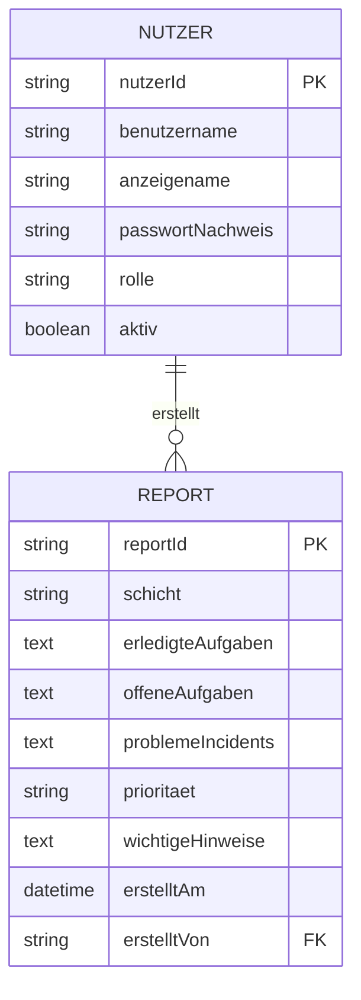

# D1 – Datenmodell

> **Status:** Arbeitsentwurf vom 29.08.2026.  
> Das Datenmodell beschreibt den fachlichen Informationsbedarf der ersten
> Reportify-Version. Es muss vom Projektteam geprüft werden.

## 1. Zweck

Dieses Dokument beschreibt die fachlichen Datenobjekte von Reportify und ihre
Beziehungen. Es legt fest, welche Informationen das System benötigt, ohne eine
konkrete Datenbank oder Programmiersprache vorzugeben.

Die konkreten Datentypen und zulässigen Werte werden später in
[D2 – Datentypen](D2-datentypen.md) beschrieben.

## 2. Fachlicher Überblick

Reportify verwaltet in der ersten Version zwei zentrale Datenobjekte:

- **Nutzer:in:** Eine Person, die sich anmeldet und Reportify verwendet.
- **Report:** Eine dokumentierte Schichtübergabe mit Aufgaben, Problemen,
  Prioritäten und Hinweisen.

Schicht, Priorität und Rolle werden als fachliche Wertetypen behandelt. Sie
benötigen im fachlichen Modell keine eigenen Objekte.

## 3. Informationsmodell

Ein:e Nutzer:in kann keinen, einen oder mehrere Reports erstellen. Jeder Report
gehört genau zu einer erstellenden Person.

## 4. Datenobjekt Nutzer:in

Das Datenobjekt **Nutzer:in** repräsentiert eine zur Verwendung von Reportify
berechtigte Person.

| Attribut | Bedeutung | Pflicht |
|---|---|---|
| `nutzerId` | Eindeutige und unveränderliche Kennung | Ja |
| `benutzername` | Eindeutiger Name für die Anmeldung | Ja |
| `anzeigename` | Name, der in Report und Historie angezeigt wird | Ja |
| `passwortNachweis` | Sicher gespeicherter Nachweis des Passworts | Ja |
| `rolle` | Fachliche Rolle innerhalb von Reportify | Ja |
| `aktiv` | Kennzeichnet, ob eine Anmeldung erlaubt ist | Ja |

### 4.1 Rolle

Für die erste Version sind folgende Rollen vorgesehen:

- `MITARBEITER`
- `SCHICHTLEITUNG`

Beide Rollen dürfen die Kernfunktionen der ersten Version verwenden. Erweiterte
Berechtigungen für die Schichtleitung sind zunächst nicht vorgesehen.

### 4.2 Sicherheitsregeln

- Benutzernamen müssen eindeutig sein.
- Passwörter dürfen niemals im Klartext gespeichert werden.
- Ein inaktives Benutzerkonto darf sich nicht anmelden.
- Bereits erstellte Reports bleiben erhalten, wenn ein Benutzerkonto deaktiviert wird.
- Ein Report zeigt den Anzeigenamen der erstellenden Person, nicht deren Passwort
  oder andere Anmeldedaten.

## 5. Datenobjekt Report

Das Datenobjekt **Report** repräsentiert die dokumentierte Übergabe einer
Arbeitsschicht.

| Attribut | Bedeutung | Pflicht |
|---|---|---|
| `reportId` | Eindeutige und unveränderliche Kennung | Ja |
| `schicht` | Schicht, auf die sich der Report bezieht | Ja |
| `erledigteAufgaben` | Während der Schicht abgeschlossene Aufgaben | Ja |
| `offeneAufgaben` | Noch nicht abgeschlossene Aufgaben | Nein |
| `problemeIncidents` | Aktuelle Probleme oder Incidents | Nein |
| `prioritaet` | Dringlichkeit der enthaltenen Probleme | Bedingt |
| `wichtigeHinweise` | Informationen für die nachfolgende Schicht | Nein |
| `erstelltAm` | Datum und Uhrzeit der Speicherung | Ja |
| `erstelltVon` | Verweis auf die erstellende Person | Ja |

**Bedingt** bedeutet, dass ein Feld einzeln leer bleiben darf. 

## 6. Fachliche Wertetypen

### 6.1 Schicht

Der Wertetyp **Schicht** besitzt in der ersten Version folgende zulässige Werte:

- `FRUEHSCHICHT`
- `SPAETSCHICHT`
- `NACHTSCHICHT`

Jeder Report muss genau einer dieser Schichten zugeordnet sein.

### 6.2 Priorität

Der Wertetyp **Priorität** besitzt folgende zulässige Werte:

- `NIEDRIG`
- `MITTEL`
- `HOCH`

Wenn ein Problem oder Incident eingetragen wird, muss eine Priorität angegeben
werden. Ohne Problem oder Incident darf die Priorität leer bleiben.

### 6.3 Rolle

Der Wertetyp **Rolle** besitzt folgende zulässige Werte:

- `MITARBEITER`
- `SCHICHTLEITUNG`

Weitere Rollen sind für die erste Version nicht vorgesehen.

## 7. Fachliche Datenregeln

| ID | Regel |
|---|---|
| DM-01 | Jeder Benutzername ist eindeutig. |
| DM-02 | Jeder Report besitzt genau eine erstellende Person. |
| DM-03 | Der Erstellungszeitpunkt wird beim Speichern durch das System vergeben. |
| DM-04 | Jeder Report besitzt eine Schicht und einen nichtleeren Eintrag im Feld "Erledigte Aufgaben". |
| DM-05 | Bei einem Problem oder Incident ist eine Priorität verpflichtend. |
| DM-06 | Ein gespeicherter Report wird in der ersten Version nicht nachträglich bearbeitet. |
| DM-07 | Ein gespeicherter Report wird in der ersten Version nicht gelöscht. |
| DM-08 | Ein deaktiviertes Benutzerkonto kann keine neuen Reports erstellen. |
| DM-09 | Reports deaktivierter Benutzerkonten bleiben in der Historie erhalten. |
| DM-10 | Die aktuelle Übergabe ist vorläufig der zuletzt gespeicherte Report. |

## 8. Lebenszyklus eines Reports

Ein Report durchläuft in der ersten Version folgende fachliche Schritte:

1. Eine angemeldete Person beginnt die Reporterstellung.
2. Die Person wählt eine Schicht und trägt fachliche Inhalte ein.
3. Reportify validiert die Eingaben.
4. Bei gültigen Eingaben wird der Report gespeichert.
5. Der gespeicherte Report erscheint in der aktuellen Übergabe und in der
   Report-Historie.

Nicht gespeicherte Eingaben sind noch kein Report im Sinne dieses Datenmodells.
Ein gesonderter Entwurfsstatus ist für die erste Version nicht vorgesehen.

## 9. Datenschutz und Aufbewahrung

- In Reports sollen nur für die Schichtübergabe notwendige Informationen erfasst
  werden.
- Passwörter und andere Anmeldedaten gehören niemals in einen Report.
- Reportify speichert für einen Report nur die fachlichen Inhalte, die erstellende
  Person und den Erstellungszeitpunkt.
- Eine automatische Löschfrist ist für die erste Version noch nicht festgelegt.

## 10. Abgrenzung

Folgende Datenobjekte sind in der ersten Version nicht vorgesehen:

- Dateianhänge
- Kommentare oder Chatnachrichten
- Benachrichtigungen
- Organisationen oder getrennte Mandanten
- persönliche Kontaktdaten
- Entwürfe nicht gespeicherter Reports
- statistische Auswertungen

## 11. Offene Teamentscheidungen

Folgende Punkte müssen vom Team abschließend bestätigt werden:

1. Soll die Priorität für den gesamten Report oder nur für Probleme gelten?
2. Soll ein gespeicherter Report später bearbeitet werden dürfen?
3. Wie lange sollen Reports aufbewahrt werden?
4. Soll die aktuelle Übergabe ausschließlich anhand des Erstellungszeitpunkts
   bestimmt werden?
5. Benötigt die Schichtleitung später zusätzliche Berechtigungen?

Bis zur Entscheidung gelten die in diesem Dokument beschriebenen Regeln als
Arbeitsgrundlage.

## 12. Nachverfolgbarkeit

Dieses Datenmodell unterstützt insbesondere:

- `UC-01` – Anmelden
- `UC-03` – Schicht auswählen
- `UC-04` – Report erstellen
- `UC-05` – Übergabe einsehen
- `UC-06` – Report-Historie anzeigen
- `AF-01` – Zugangsdaten prüfen
- `AF-04` – Report-Eingaben validieren
- `AF-05` – Report speichern
- `AF-06` – Aktuelle Übergabe bestimmen
- `AF-07` – Report-Historie bereitstellen
- `AF-08` – Report-Details bereitstellen
