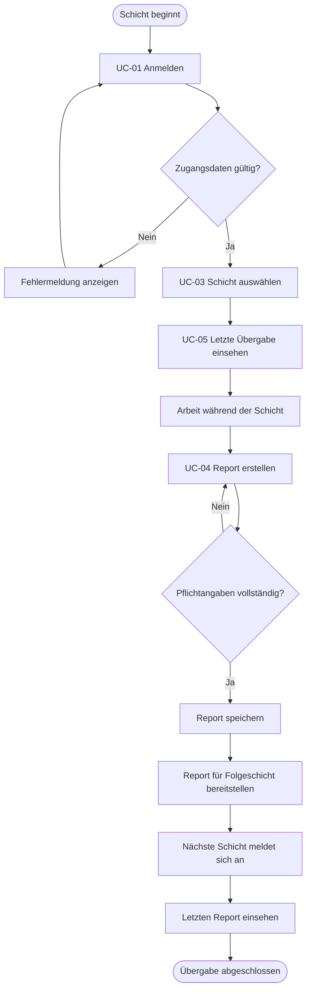

# F1 – Geschäftsprozesse

> **Status:** Entwurf vom 29. August 2026. Noch nicht vom Team abschließend
> geprüft und freigegeben.

## 1. Zweck

Der zentrale Geschäftsprozess von Reportify ist die digitale
Schichtübergabe. Eine ausgehende Schicht dokumentiert ihren Arbeitsstand in
einem Report. Die nachfolgende Schicht kann diesen Report einsehen und die
Arbeit mit einem einheitlichen Informationsstand fortsetzen.

Reportify dokumentiert die Übergabe. Die eigentliche Durchführung der
betrieblichen Aufgaben findet außerhalb der Anwendung statt.

## 2. Beteiligte Rollen

### Mitarbeiter:in

- meldet sich bei Reportify an,
- wählt eine Schicht aus,
- erstellt einen Report,
- sieht den letzten Report und die Historie ein.

### Schichtleitung

- besitzt die Funktionen einer Mitarbeiterin beziehungsweise eines Mitarbeiters,
- kann Reports und dringende Probleme überblicken,
- übernimmt im Minimalumfang keine Benutzerverwaltung.

## 3. Eingaben und Ergebnis

Für eine Schichtübergabe werden folgende Informationen erfasst:

- ausgewählte Schicht,
- erledigte Aufgaben,
- offene Aufgaben,
- Probleme oder Incidents,
- Priorität eines Problems,
- wichtige Hinweise.

Das Ergebnis ist ein gespeicherter Report mit Erstellungszeitpunkt,
verantwortlicher Person und zugehöriger Schicht. Er steht anschließend für
die nachfolgende Schicht und die Historie zur Verfügung.

## 4. Hauptprozess „Schichtübergabe durchführen“

### Beschreibung des Ablaufs

1. Eine Person meldet sich bei Reportify an.
2. Bei ungültigen Zugangsdaten bleibt der Zugriff auf die Anwendung gesperrt.
3. Nach erfolgreicher Anmeldung wählt die Person ihre aktuelle Schicht aus.
4. Das System zeigt den zuletzt gespeicherten Report als vorherige Übergabe an.
5. Die Person kann während beziehungsweise am Ende der Schicht einen neuen
   Report erstellen.
6. Das System prüft die erforderlichen Angaben.
7. Ein gültiger Report wird mit Schicht, verantwortlicher Person und
   Erstellungszeitpunkt gespeichert.
8. Der gespeicherte Report steht unmittelbar für die nachfolgende Schicht zur Verfügung.
9. Die nachfolgende Schicht meldet sich an und sieht den letzten Report ein.
10. Ältere Reports bleiben über die Historie nachvollziehbar.

## 5. Geschäftsregeln

### GR-01 – Anmeldung

Nur angemeldete Nutzer:innen dürfen Reports und Schichtinformationen einsehen
oder erfassen.

### GR-02 – Schichtzuordnung

Jeder Report gehört genau zu einer ausgewählten Schicht.

### GR-03 – Verantwortlichkeit

Das System ordnet jedem Report automatisch die angemeldete Person als
Autor:in zu.

### GR-04 – Erstellungszeitpunkt

Das System erfasst den Zeitpunkt der Speicherung automatisch.

### GR-05 – Prioritäten

Ein Problem oder Incident kann mit einer der Prioritäten `NIEDRIG`, `MITTEL`
oder `HOCH` gekennzeichnet werden.

### GR-06 – Nachvollziehbarkeit

Das Speichern eines neuen Reports löscht keine älteren Reports. Diese bleiben
in der Historie erhalten.

### GR-07 – Aktuelle Übergabe

In der Übergabeansicht wird der zuletzt gespeicherte Report angezeigt.

### GR-08 – Fehlende Übergabe

Existiert noch kein vorheriger Report, zeigt das System einen verständlichen
Hinweis statt einer leeren oder fehlerhaften Seite an.

## 6. Ausnahmefälle

### Ungültige Zugangsdaten

Die Anmeldung wird abgelehnt. Es wird keine Sitzung erstellt und die Person
erhält keinen Zugriff auf geschützte Funktionen.

### Unvollständiger Report

Der Report wird nicht gespeichert. Das System kennzeichnet die fehlenden
beziehungsweise ungültigen Eingaben.

### Technischer Speicherfehler

Das System zeigt eine Fehlermeldung an und bestätigt die Speicherung nicht.
Ein nicht erfolgreich gespeicherter Report darf nicht als aktuelle Übergabe
angezeigt werden.

### Keine vorherige Übergabe vorhanden

Das System informiert die Person, dass noch kein Report vorhanden ist. Die
übrigen Funktionen bleiben verwendbar.

## 7. Bezug zu den Anwendungsfällen

- UC-01 – Anmelden
- UC-02 – Abmelden
- UC-03 – Schicht auswählen
- UC-04 – Report erstellen
- UC-05 – Übergabe einsehen
- UC-06 – Report-Historie anzeigen

## 8. Offene Teamentscheidungen

Die folgenden Punkte müssen beim nächsten Teamtermin festgelegt werden:

1. Darf ein bereits gespeicherter Report nachträglich bearbeitet werden?
2. Welche Eingaben eines Reports sind verpflichtend?
3. Wird die aktuelle Übergabe ausschließlich über den Speicherzeitpunkt oder
   zusätzlich über eine feste Schichtreihenfolge bestimmt?
4. Darf nur die Schichtleitung Reports anderer Personen ändern oder löschen?
5. Soll das Löschen von Reports im Minimalumfang vollständig ausgeschlossen werden?