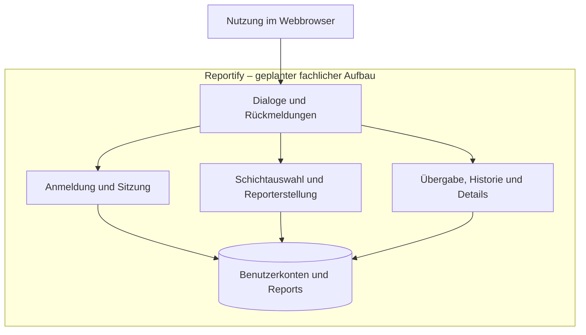

# P2 – Architekturüberblick

> **Status:** Arbeitsentwurf vom 30.08.2026.  
> Dieses Dokument beschreibt den geplanten fachlichen Aufbau der ersten Version.
> Es ist kein Nachweis bereits implementierter Komponenten. Die Freigabe durch
> das Team und der Abgleich mit dem Quellcode stehen noch aus.

## 1. Zweck und Einordnung

Dieser Überblick ordnet die spezifizierten Funktionen von Reportify in fachliche
Verantwortungsbereiche ein. Er zeigt die Systemgrenze, die benötigten Informationen
und die Anforderungen, die bei der späteren Architektur berücksichtigt werden müssen.

P2 ergänzt [P1 – Ziele und Rahmenbedingungen](P1-ziele-rahmenbedingungen.md).
Die vollständigen Abläufe stehen in [F2](F2-anwendungsfaelle.md), die zugehörigen
Systemfunktionen in [F3](F3-anwendungsfunktionen.md).

Die Bereiche dieses Dokuments legen keine Klassen, Pakete, Framework-Komponenten
oder getrennt betriebenen Dienste fest. Diese technischen Entscheidungen werden
in der späteren Architekturdokumentation begründet.

## 2. Systemgrenze

Mitarbeitende und Schichtleitungen verwenden Reportify über einen Webbrowser.
Die Anwendung nimmt Zugangsdaten und Report-Eingaben entgegen und zeigt
Rückmeldungen, die aktuelle Übergabe, die Historie und einzelne Report-Details an.

Innerhalb der fachlichen Systemgrenze liegen die Prüfung der Anmeldung, die
Sitzungsverwaltung, die Verarbeitung der Report-Eingaben und das Bereitstellen
gespeicherter Reports. Zur Anwendung gehört außerdem die Aufbewahrung der dafür
benötigten Benutzerkonten und Report-Daten.

Außerhalb liegen die tatsächliche Durchführung der betrieblichen Aufgaben und die
Organisation des Schichtbetriebs. Reportify dokumentiert deren Arbeitsstand;
es führt keine Aufgaben aus und erstellt keine Dienstpläne.

Externe Fachsysteme und APIs, Chat, Benachrichtigungen, Dateianhänge und eine
native Mobile-App gehören nicht zur ersten Version. Die Browseroberfläche ist
der vorgesehene Zugang zu den fachlichen Funktionen.

## 3. Geplante fachliche Gliederung

Das Diagramm zeigt Verantwortungsbereiche und ihren Informationsbedarf.
Es beschreibt weder die Reihenfolge einzelner Aufrufe noch eine technische
Verteilung auf Server oder Programme.

Die Anmeldung schützt sämtliche fachlichen Report-Funktionen, auch wenn eine
Person eine geschützte Seite direkt aufruft. Das Diagramm zeigt diesen
übergreifenden Zugriffsschutz nicht als einzelne Verbindung zu jedem Bereich.

| Bereich | Verantwortung | Bezug zur Spezifikation |
|---|---|---|
| Dialoge und Rückmeldungen | Eingaben ermöglichen, Informationen darstellen und Erfolg, Fehler sowie Leerzustände erklären | B1: DLG-01 bis DLG-06 |
| Anmeldung und Sitzung | Zugangsdaten prüfen, angemeldete Sitzungen verwalten und Abmeldungen verarbeiten | F2: UC-01, UC-02; F3: AF-01, AF-02 |
| Schichtauswahl und Reporterstellung | Auswahlwerte bereitstellen, Eingaben validieren und gültige Reports speichern | F2: UC-03, UC-04; F3: AF-03 bis AF-05; B1: DLG-03 |
| Übergabe, Historie und Details | Aktuelle Übergabe bestimmen, Reports zeitlich geordnet auflisten und einzelne Reports vollständig anzeigen | F2: UC-05, UC-06; F3: AF-06 bis AF-08; B1: DLG-04 bis DLG-06 |
| Benutzerkonten und Reports | Die für Anmeldung, Zuordnung und spätere Anzeige benötigten Informationen aufbewahren | D1: Nutzer:in und Report; D2: DT-01 bis DT-12 |

Die Datenobjekte und ihre Beziehungen werden ausschließlich in
[D1 – Datenmodell](D1-datenmodell.md) beschrieben. Insbesondere sind Schicht,
Rolle und Priorität dort Wertetypen. Aufgaben und Incidents sind Report-Inhalte,
keine zusätzlich verwalteten Datenobjekte.

## 4. Zusammenspiel bei der Reporterstellung und Anzeige

Der geplante Zusammenhang der Verantwortungsbereiche ergibt sich aus `UC-04`
und `AF-03` bis `AF-05`:

1. Eine angemeldete Person wählt eine gültige Schicht und erfasst Report-Inhalte.
2. Reportify prüft die Eingaben anhand der fachlichen Regeln aus F3 und D2.
3. Bei ungültigen Eingaben wird kein Report gespeichert; die Person erhält
   verständliche Rückmeldungen zu den betroffenen Feldern.
4. Bei gültigen Eingaben ergänzt Reportify die erstellende Person und den
   Erstellungszeitpunkt und speichert den vollständigen Report.
5. Erst nach erfolgreicher Speicherung wird der Erfolg bestätigt und der
   gespeicherte Report angezeigt.
6. Der Report steht anschließend der Historie und den Detailaufrufen zur Verfügung.
   Ob er beim späteren Aufruf die aktuelle Übergabe ist, richtet sich nach `AF-06`.

Die Historie, die aktuelle Übergabe und die Detailansicht greifen auf dieselben
gespeicherten Reports zu. Sie sind unterschiedliche Ansichten und erzeugen beim
Lesen keine zusätzlichen Reports oder Änderungen an bestehenden Reports.

Der genaue Ort der Schichtauswahl bleibt offen: `TD-017` klärt, ob sie als
vorgelagerter Sitzungskontext oder direkt im Reportformular erfolgt.
Die Gliederung in Abschnitt 3 nimmt diese Entscheidung nicht vorweg.

## 5. Anforderungen mit Einfluss auf die Architektur

Folgende Anforderungen aus [N1](N1-nichtfunktional.md) sind für die spätere
technische Ausarbeitung besonders relevant:

- **Zugriffsschutz:** `NFR-15a-01` bis `NFR-15a-03` verlangen geschützte
  Report-Funktionen, eine sichere Anmeldung und eine wirksame Abmeldung.
  Eine bloß ausgeblendete Navigation genügt dafür nicht.
- **Passwortnachweise und Eingaben:** `NFR-15b-01` und `NFR-15b-02` verlangen
  sichere Passwortspeicherung und Schutz vor manipulierten Eingaben. Die
  technischen Verfahren werden in der Architektur beschrieben.
- **Dauerhafte, vollständige Speicherung:** `NFR-12d-01` und `NFR-12d-02`
  verlangen, dass bestätigte Reports einen Anwendungsneustart überstehen und
  fehlgeschlagene Speichervorgänge keinen teilweise gespeicherten Report erzeugen.
- **Nachvollziehbarkeit und Tests:** `NFR-14a-01`, `NFR-14b-01` und
  `NFR-15d-01` verlangen verständliche Zuständigkeiten, automatisierte Prüfungen
  der Kernregeln sowie eine nachvollziehbare Zuordnung von Ersteller:in und Zeitpunkt.
- **Bedienbarkeit und Leistung:** `NFR-10a-01`, `NFR-13a-01`, `NFR-12a-01`
  und `NFR-12e-01` beeinflussen die Darstellung und die Verarbeitung gespeicherter
  Daten. Die vorläufigen Browser-, Breiten-, Leistungs- und Mengenziele müssen
  über `TD-015` und `TD-016` bestätigt werden.

Die Prioritäten und vollständigen Akzeptanzkriterien bleiben in N1 maßgeblich.
Ihre Nennung in P2 ändert weder ihre Priorität noch den Status als Arbeitsentwurf.

## 6. Offene Entscheidungen und ihre Auswirkungen

Der jeweils aktuelle Status steht in
[TEAM-ENTSCHEIDUNGEN.md](../TEAM-ENTSCHEIDUNGEN.md). Für diesen Überblick sind
insbesondere folgende Abstimmungen relevant:

- `TD-001`, `TD-002` und `TD-013`: beeinflussen Pflichtangaben, die Bedeutung
  der Priorität und die Validierung der Report-Texte.
- `TD-003` und `TD-004`: betreffen eine mögliche spätere Bearbeitung oder
  Löschung. Beides ist im aktuellen MVP nicht vorgesehen.
- `TD-005`: legt die Auswahl der aktuellen Übergabe fest. Arbeitsannahme ist
  weiterhin der zuletzt gespeicherte Report anhand seines Erstellungszeitpunkts.
- `TD-006` und `TD-008`: betreffen Berechtigungen und die Bereitstellung von
  Benutzerkonten. Arbeitsannahmen sind gleiche Kernrechte für beide Rollen
  und vorbereitete Konten ohne Selbstregistrierung.
- `TD-007` und `TD-009`: beeinflussen Aufbewahrung und Datenhaltung. Die
  endgültige Datenbank und die Aufbewahrungsdauer sind noch nicht beschlossen.
- `TD-014`: betrifft die Passwortregel und ihre technische Umsetzung.
- `TD-015` und `TD-016`: bestimmen die zu bestätigenden Qualitäts- und Testziele.
- `TD-017`: betrifft die Schichtauswahl und den Zusammenhang zwischen den Dialogen.

Diese Punkte werden nicht durch den Architekturüberblick entschieden.
Nach einer Teamentscheidung müssen die betroffenen Spezifikationskapitel und
anschließend Architektur, Implementierung und Tests zusammenpassen.

## 7. Übergang zur detaillierten Architektur

Die spätere Architekturdokumentation wird anhand von
[arc42](https://arc42.org/overview/) ausgearbeitet. Sie konkretisiert unter anderem:

- die technische Zuordnung der fachlichen Verantwortungen zu tatsächlich
  vorhandenen beziehungsweise geplanten Komponenten,
- die Umsetzung von Zugriffsschutz, Validierung und dauerhafter Speicherung,
- wichtige Laufzeitabläufe einschließlich Fehlerfällen,
- die Betriebsumgebung, Konfiguration und nachvollziehbare lokale Inbetriebnahme,
- technische Entscheidungen mit Alternativen und Begründung in ADRs,
- den Nachweis der relevanten Qualitätsanforderungen durch Tests.

P2 ersetzt weder diese Architektur noch einen Abgleich mit dem Quellcode.
Die Zuordnung über UC-, AF-, DLG-, DT- und NFR-Kennungen wird dort weitergeführt.
Die Fachbegriffe richten sich nach [E2 – Glossar](E2-glossar.md).