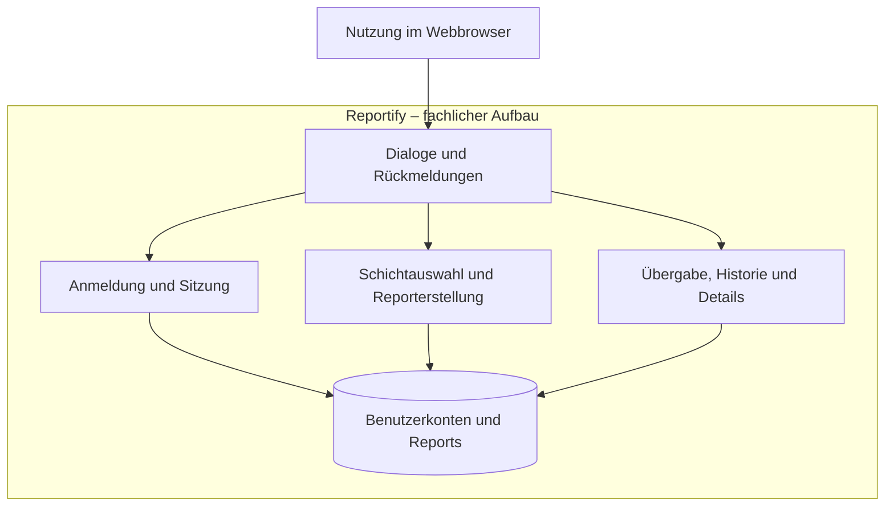

# P2 – Architekturüberblick

> **Status:** Mit der technischen Architektur und dem Quellcode abgeglichener
> Stand vom 25.09.2026. Die formale Teamfreigabe steht noch aus.

## 1. Zweck und Einordnung

Dieser Überblick ordnet die spezifizierten Funktionen von Reportify in fachliche
Verantwortungsbereiche ein. Er zeigt die Systemgrenze, die benötigten Informationen
und die Anforderungen, die in der technischen Architektur berücksichtigt werden.

P2 ergänzt [P1 – Ziele und Rahmenbedingungen](P1-ziele-rahmenbedingungen.md).
Die vollständigen Abläufe stehen in [F2](F2-anwendungsfaelle.md), die zugehörigen
Systemfunktionen in [F3](F3-anwendungsfunktionen.md).

Die Bereiche dieses Dokuments legen keine Klassen, Pakete, Framework-Komponenten
oder getrennt betriebenen Dienste fest. Diese technischen Entscheidungen sind
in der [Architekturdokumentation](../arch/README.md) begründet.

## 2. Systemgrenze

Mitarbeitende und Schichtleitungen verwenden Reportify über einen Webbrowser.
Die Anwendung nimmt Zugangsdaten und Report-Eingaben entgegen und zeigt
Rückmeldungen, die aktuelle Übergabe, die Historie und einzelne Report-Details an.

Innerhalb der fachlichen Systemgrenze liegen die Prüfung der Anmeldung, die
Sitzungsverwaltung, die Verarbeitung der Report-Eingaben und das Bereitstellen
gespeicherter Reports. Zur Anwendung gehört außerdem die Aufbewahrung der dafür
benötigten Benutzerkonten und Report-Daten.

Außerhalb liegen die tatsächliche Durchführung der betrieblichen Aufgaben und die
Organisation des Schichtbetriebs. Reportify dokumentiert deren Arbeitsstand;
es führt keine Aufgaben aus und erstellt keine Dienstpläne.

Externe Fachsysteme und APIs, Chat, Benachrichtigungen, Dateianhänge und eine
native Mobile-App gehören nicht zur ersten Version. Die Browseroberfläche ist
der vorgesehene Zugang zu den fachlichen Funktionen.

## 3. Fachliche Gliederung

Das Diagramm zeigt Verantwortungsbereiche und ihren Informationsbedarf.
Es beschreibt weder die Reihenfolge einzelner Aufrufe noch eine technische
Verteilung auf Server oder Programme.

Die Anmeldung schützt sämtliche fachlichen Report-Funktionen, auch wenn eine
Person eine geschützte Seite direkt aufruft. Das Diagramm zeigt diesen
übergreifenden Zugriffsschutz nicht als einzelne Verbindung zu jedem Bereich.

| Bereich | Verantwortung | Bezug zur Spezifikation |
|---|---|---|
| Dialoge und Rückmeldungen | Eingaben ermöglichen, Informationen darstellen und Erfolg, Fehler sowie Leerzustände erklären | B1: DLG-01 bis DLG-06 |
| Anmeldung und Sitzung | Zugangsdaten prüfen, angemeldete Sitzungen verwalten und Abmeldungen verarbeiten | F2: UC-01, UC-02; F3: AF-01, AF-02 |
| Schichtauswahl und Reporterstellung | Auswahlwerte bereitstellen, Eingaben validieren und gültige Reports speichern | F2: UC-03, UC-04; F3: AF-03 bis AF-05; B1: DLG-03 |
| Übergabe, Historie und Details | Aktuelle Übergabe bestimmen, Reports zeitlich geordnet auflisten und einzelne Reports vollständig anzeigen | F2: UC-05, UC-06; F3: AF-06 bis AF-08; B1: DLG-04 bis DLG-06 |
| Benutzerkonten und Reports | Die für Anmeldung, Zuordnung und Anzeige benötigten Informationen aufbewahren | D1: Nutzer:in und Report; D2: DT-01 bis DT-13 |

Die Datenobjekte und ihre Beziehungen werden ausschließlich in
[D1 – Datenmodell](D1-datenmodell.md) beschrieben. Insbesondere sind Schicht,
Rolle und Priorität dort Wertetypen. Aufgaben und Incidents sind Report-Inhalte,
keine zusätzlich verwalteten Datenobjekte.

## 4. Zusammenspiel bei der Reporterstellung und Anzeige

Der Zusammenhang der Verantwortungsbereiche ergibt sich aus `UC-04`
und `AF-03` bis `AF-05`:

1. Eine angemeldete Person wählt eine gültige Schicht und erfasst Report-Inhalte.
2. Reportify prüft die Eingaben anhand der fachlichen Regeln aus F3 und D2.
3. Bei ungültigen Eingaben wird kein Report gespeichert; die Person erhält
   verständliche Rückmeldungen zu den betroffenen Feldern.
4. Bei gültigen Eingaben ergänzt Reportify die erstellende Person und den
   Erstellungszeitpunkt und speichert den vollständigen Report.
5. Erst nach erfolgreicher Speicherung wird der Erfolg bestätigt und der
   gespeicherte Report angezeigt.
6. Der Report steht anschließend der Historie und den Detailaufrufen zur Verfügung.
   Beim nächsten Aufruf wird er nach `AF-06` als aktuelle Übergabe bestimmt.

Die Historie, die aktuelle Übergabe und die Detailansicht greifen auf dieselben
gespeicherten Reports zu. Sie sind unterschiedliche Ansichten und erzeugen beim
Lesen keine zusätzlichen Reports oder Änderungen an bestehenden Reports.

Gemäß `TD-017` erfolgt die Schichtauswahl direkt im Reportformular.

## 5. Anforderungen mit Einfluss auf die Architektur

Folgende Anforderungen aus [N1](N1-nichtfunktional.md) sind für die technische
Ausgestaltung besonders relevant:

- **Zugriffsschutz:** `NFR-15a-01` bis `NFR-15a-03` verlangen geschützte
  Report-Funktionen, eine sichere Anmeldung und eine wirksame Abmeldung.
  Eine bloß ausgeblendete Navigation genügt dafür nicht.
- **Passwortnachweise und Eingaben:** `NFR-15b-01` und `NFR-15b-02` verlangen
  sichere Passwortspeicherung und Schutz vor manipulierten Eingaben. Die
  technischen Verfahren werden in der Architektur beschrieben.
- **Dauerhafte, vollständige Speicherung:** `NFR-12d-01` und `NFR-12d-02`
  verlangen, dass bestätigte Reports einen Anwendungsneustart überstehen und
  fehlgeschlagene Speichervorgänge keinen teilweise gespeicherten Report erzeugen.
- **Nachvollziehbarkeit und Tests:** `NFR-14a-01`, `NFR-14b-01` und
  `NFR-15d-01` verlangen verständliche Zuständigkeiten, automatisierte Prüfungen
  der Kernregeln sowie eine nachvollziehbare Zuordnung von Ersteller:in und Zeitpunkt.
- **Bedienbarkeit und Leistung:** `NFR-10a-01`, `NFR-13a-01`, `NFR-12a-01`
  und `NFR-12e-01` beeinflussen die Darstellung und die Verarbeitung gespeicherter
  Daten. Die Browser-, Breiten-, Leistungs- und Mengenziele aus `TD-015` und
  `TD-016` sind vereinbart; noch offene Nachweise stehen in `docs/ABNAHME.md`.

Die Prioritäten und vollständigen Akzeptanzkriterien bleiben in N1 maßgeblich.
Ihre Nennung in P2 ändert ihre Priorität nicht.

## 6. Teamentscheidungen und ihre Auswirkungen

Der jeweils aktuelle Status der Teamentscheidungen steht in
[TEAM-ENTSCHEIDUNGEN.md](../TEAM-ENTSCHEIDUNGEN.md). Für diesen Überblick sind
insbesondere folgende eingearbeitete Entscheidungen relevant:

- `TD-001`, `TD-002` und `TD-013`: beeinflussen Pflichtangaben, die Bedeutung
  der Priorität und die Validierung der Report-Texte.
- `TD-003` und `TD-004`: Gespeicherte Reports dürfen nachträglich bearbeitet werden.     Das Löschen gespeicherter Reports ist ausschließlich durch die Schichtleitung      zulässig.
- `TD-005`: Die aktuelle Übergabe ist der zuletzt gespeicherte Report.
- `TD-006` und `TD-008`: Mitarbeiter:innen und Schichtleitungen dürfen die
  allgemeinen Funktionen von Reportify verwenden. Die Schichtleitung besitzt
  zusätzlich die Berechtigung, gespeicherte Reports zu löschen.
  Benutzerkonten werden vorbereitet bereitgestellt; eine Selbstregistrierung ist nicht   vorgesehen.
- `TD-007`: In der ersten Version findet keine automatische Löschung gespeicherter Reports statt.
- `TD-009`: Für Version 1 wird H2 als relationale Datenbank verwendet.
  Die Architekturentscheidung ist in `ADR-003 – H2-Datenbank für Version 1`
  dokumentiert. Der Datenzugriff erfolgt über Spring Data JPA.
- `TD-014`: betrifft die Passwortregel und ihre technische Umsetzung.
- `TD-015` und `TD-016`: bestimmen die zu bestätigenden Qualitäts- und Testziele.
- `TD-017`: Die Schicht wird direkt im Reportformular ausgewählt.

Die Entscheidungen sind in Spezifikation, Architektur und Implementierung
eingearbeitet. Fehlende Qualitätsnachweise werden gesondert ausgewiesen.

## 7. Bezug zur detaillierten Architektur

Die [Architekturdokumentation](../arch/README.md) orientiert sich an
[arc42](https://arc42.org/overview/) und konkretisiert unter anderem:

- die technische Zuordnung der fachlichen Verantwortungen zu tatsächlich
  vorhandenen Komponenten,
- die Umsetzung von Zugriffsschutz, Validierung und dauerhafter Speicherung,
- wichtige Laufzeitabläufe einschließlich Fehlerfällen,
- die Betriebsumgebung, Konfiguration und nachvollziehbare lokale Inbetriebnahme,
- technische Entscheidungen mit Alternativen und Begründung in ADRs,
- den Nachweis der relevanten Qualitätsanforderungen durch Tests.

P2 ersetzt weder diese Architektur noch den Abgleich mit dem Quellcode.
Die Zuordnung über UC-, AF-, DLG-, DT- und NFR-Kennungen wird dort weitergeführt.
Die Fachbegriffe richten sich nach [E2 – Glossar](E2-glossar.md).
